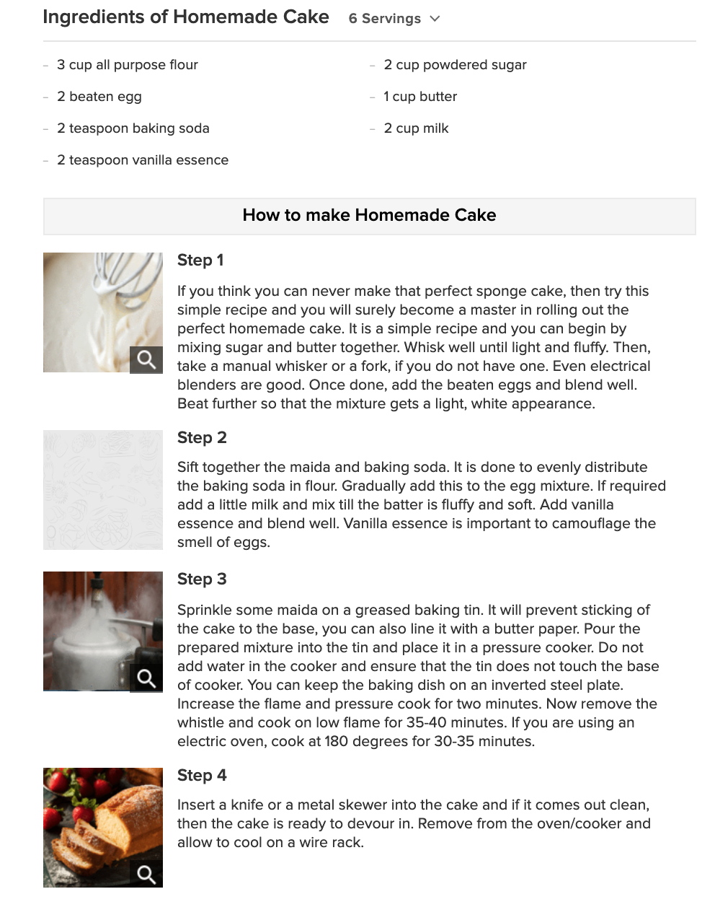
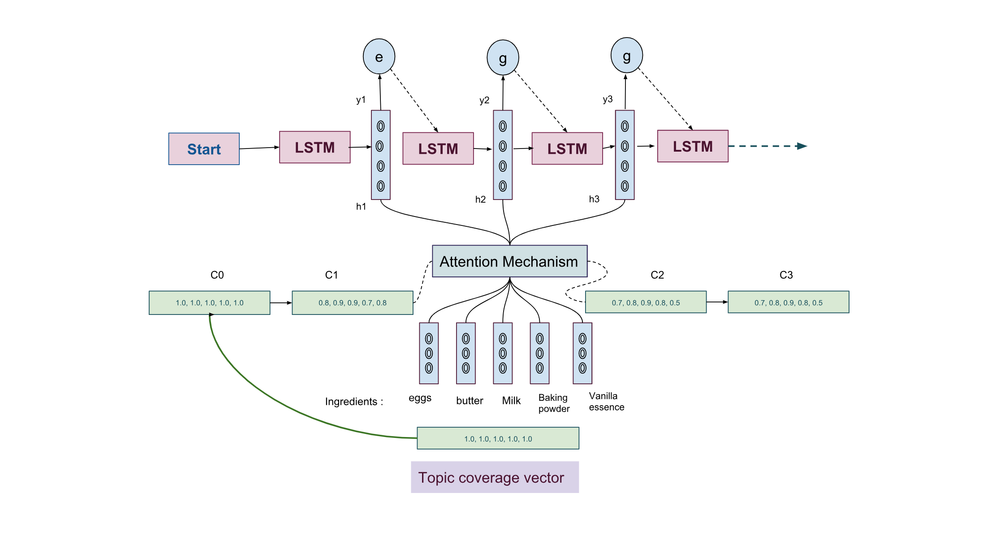

# Generating recipes using multi-ingredient aware LSTM 

## Learning objectives
This introductory tutorial explains how to generate recipes with ingredients available to user using multi-ingredient aware LSTM network.

## Prerequisites
If you are new to Neural Network and Text Generation using LSTMs. The following links will provide you detailed information about everything you need to know to understand and scale this tutorial in various applications.

* [Neural Networks-basic knowledge how they work](http://colah.github.io/).
* [RNNs](http://karpathy.github.io/2015/05/21/rnn-effectiveness/).
* [LSTMS](http://colah.github.io/posts/2015-08-Understanding-LSTMs/).
* [LSTM for Text Generation](https://medium.freecodecamp.org/applied-introduction-to-lstms-for-text-generation-380158b29fb3).
* [Generating song lyrics](https://medium.com/coinmonks/word-level-lstm-text-generator-creating-automatic-song-lyrics-with-neural-networks-b8a1617104fb)

## Estimated time
Completing this tutorial should take about 45 minutes.

## Steps
This tutorial consists of the following steps:
* Problem Statement. 
* Data Collection and Construction for Training the multi-ingredient aware LSTM.
* Methodology.
    * Topic-Averaged LSTM (TAV-LSTM)
    * Topic-Attention LSTM (TAT-LSTM)
    * Multi-Topic-Aware LSTM (MTA-LSTM)

## Problem Statement

Text generation is a fundamental and challenging task in natural language processing and computational linguistics. The task of recipe generation is even more challenging. Because of two following reasons:
* It has to understand multiple ingredients.
* Understanding the context of all the ingredients put together to create a recipe.
* How to predict sequence of steps of the recipe.

Given a set I = {ingredient 1, ..., ingredient i , ..., ingredient k} consisting of ingredients, recipe generation aims at generating a recipe for the user using ingredients available to them.

Example : 

Sample ingredients 1 = {eggs, onion. Bread}

Sample ingredients 2 = {Green tea, chocolate powder, baking soda, milk}

## Data Collection and Construction for Training the multi-ingredient aware LSTM.

* Web Crawling: In order to guarantee the quality of the crawled text, crawl only the compositions which contain some reviews and scores. 
* Crawl websites like epicurious and Bon appetite. 
* Follow the same process with both and form a corpus.
* The process of the data collection is summarized as follows: 
* Crawl the articles, perform Content linking Algorithms on the crawled articles and pick the ones which have high scores. 
* Text Summarization of these articles with limited to 50 to 120 words and store them.
* Employ TextRank to extract keywords as topic words. 
* From the Collected paragraph-level essays randomly select them in proportion of 6:1 as training set and as test set . Name this dataset as `recipes`.


 

## Methodology for constructing a multi-ingredient aware LSTM. 

### Topic-Averaged LSTM (TAV-LSTM) - The original basic LSTM 
 In this part, we describe a [topic-averaged long short-term memory (TAV-LSTM)](https://machinelearningmastery.com/encoder-decoder-models-text-summarization-keras/) for recipe generation. The topic semantics is represented as an average weighted summation of all topic words embeddings. It is capable of computing the representation of a longer expression (e.g. a sentence) from the sequence of its input words one by one, which can be viewed as an encoding process. And the decoding phase can be seen as an inverse process of encoding. 

### Topic-Attention LSTM (TAT-LSTM) 
The aforementioned TAV-LSTM model learns topic information through an average weighted summation of input topic words embeddings. That is to say, each topic word is considered in a unified way. The new model extends TAV-LSTM by introducing an attention mechanism, which scores the semantic relatedness of each topic word with the generating word and softly selects the relevant topic words to guide the model.

### Multi—Ingredient Aware LSTM (MTA-LSTM)
Although TAT-LSTM could make better use of the topic information yet not good enough because it cannot guarantee that the semantic of all the topic words are represented in the generated essay. Furthermore, conventional attention model, like TAT-LSTM, tends to ignore the past attentional historical information, which may lead to a situation where some topic words appear repeatedly while the others do not appear in the generated text. To address both problems, introduce a multi-topic-aware LSTM (MTA-LSTM) by adding a topic aware component on the aforementioned TAT-LSTM model. The basic idea is to maintain a topic coverage vector, each dimension of which represents the degree to which a topic word needs to be expressed in future generation, to adjust the attention policy, so that the model can consider more about unexpressed topic words. Topic distributed information could improve the thematic integrity and readability of the generated essay.

 

# Summary
In this tutorial,  we have discussed a multi-ingredient-aware approach for recipe generation to ensure the recipe involves the semantics of all topic words. Compared with conventional nature language generator like attention-based sequence to sequence model, this approach takes into account the multi-topic distribution. This model has the ability to generate multi-topic related and expression-coherent recipes by incorporating attention and coverage mechanism.

